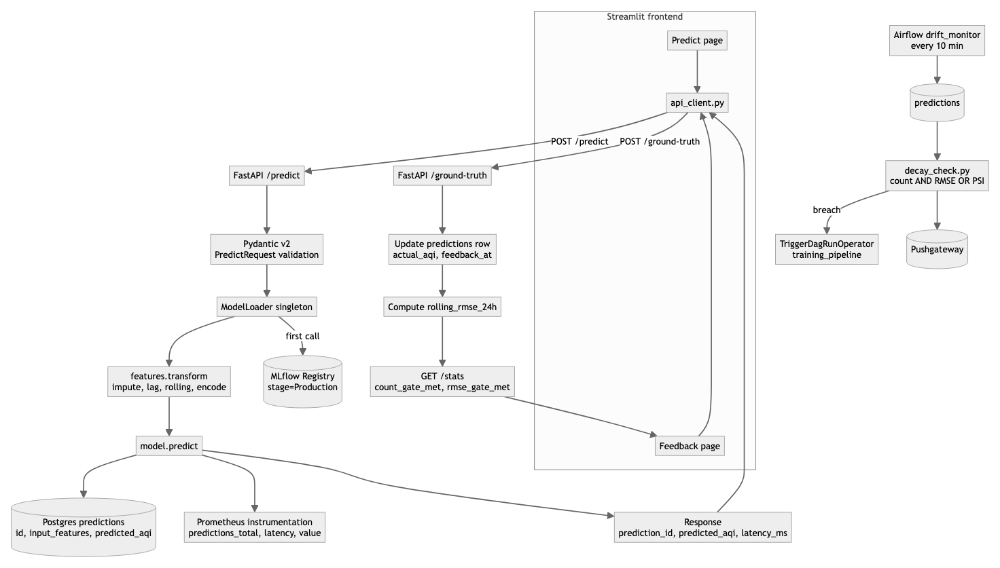

# Low-Level Design — AQI MLOps

Endpoint spec, I/O contracts, data models, and module layout.

## 0. Request-flow overview

The flowchart below traces a single `POST /predict` call through input
validation, the cached `ModelLoader` singleton, the registry-backed model
artifact, feature transformation, persistence, and instrumentation, and then
traces the corresponding `POST /ground-truth` call through to its effect on
the rolling-RMSE gate consumed by the Airflow `drift_monitor` DAG.



The diagram surfaces two design choices echoed in the HLD: the `ModelLoader`
is a singleton so registry lookups are amortized across requests, and the
drift monitor is decoupled from the API entirely — it shares state only
through the Postgres `predictions` table. This keeps the synchronous
inference path fast and observable in isolation while still allowing the
asynchronous retraining loop to react to live ground-truth feedback.

## 1. REST API — FastAPI (`src/api/main.py`)

Base URL: `http://api:8000` (container) / `http://localhost:8000` (host).
OpenAPI UI: `/docs`.

### 1.1 `GET /health`
**Purpose:** liveness probe (cheap, always returns OK if process is up).

**Response 200:**
```json
{ "status": "ok", "service": "aqi-api" }
```

### 1.2 `GET /ready`
**Purpose:** readiness probe — reports whether the Production model is loaded.

**Response 200 (ready):**
```json
{
  "ready": true,
  "model_loaded": true,
  "model_name": "aqi_regressor",
  "model_version": "5"
}
```

**Response 200 (not ready):**
```json
{
  "ready": false,
  "model_loaded": false,
  "detail": "No Production model in registry"
}
```

### 1.3 `POST /predict`
**Purpose:** single-reading AQI prediction.

**Request body:**
```json
{
  "reading": {
    "city": "Delhi",
    "date": "2025-04-23",
    "PM2.5": 110.5, "PM10": 180.0,
    "NO": 15.2,    "NO2": 40.1,  "NOx": 55.0,
    "NH3": 12.3,   "CO": 1.1,    "SO2": 8.2,
    "O3": 25.0,    "Benzene": 2.1,
    "Toluene": 5.3, "Xylene": 1.4
  },
  "history": []
}
```

`reading.date`: ISO `YYYY-MM-DD`. `reading.city`: string. Pollutant fields: float, all optional (zero-filled if absent). `history`: up to 14 past `PollutantReading` objects for lag features.

**Response 200:**
```json
{
  "prediction_id": "b7f3e2a0-...",
  "predicted_aqi": 245.8,
  "model_version": "5",
  "model_stage": "Production",
  "timestamp": "2025-04-23T12:34:56.789Z",
  "latency_ms": 12.345
}
```

**Errors:**
- `422` — Pydantic validation (bad field types)
- `503` — `"Model not loaded"` (registry empty or artifact missing)
- `500` — `"Inference error: ..."` (model predict raised)

### 1.4 `POST /ground-truth`
**Purpose:** report actual observed AQI for a past prediction — closes the feedback loop.

**Request body:**
```json
{ "prediction_id": "b7f3e2a0-...", "actual_aqi": 238.0 }
```

**Response 200:**
```json
{ "status": "recorded", "rolling_rmse_24h": 12.4 }
```

**Errors:**
- `404` — `"prediction_id not found"`
- `422` — validation

### 1.5 `GET /stats`
**Purpose:** rolling stats + retrain-trigger configuration. Used by the Home and Feedback pages to show progress toward the next retrain.

**Response 200:**
```json
{
  "rolling_rmse_24h": 112.4,
  "feedback_count_window": 7,
  "window_hours": 24,
  "feedback_count_threshold": 10,
  "rmse_threshold": 100.0,
  "psi_threshold": 1.5,
  "count_gate_met": false,
  "rmse_gate_met": true
}
```
`rolling_rmse_24h` is `null` when no ground-truth feedback exists in the window.

### 1.6 `GET /feedback?limit=N`
**Purpose:** list recent feedback rows (predictions with actual_aqi set). Newest first. Drives the feedback history table on the frontend.

**Response 200:**
```json
{
  "count": 2,
  "rows": [
    {
      "prediction_id": "b7f...",
      "created_at": "2025-04-23T12:00:00",
      "feedback_at": "2025-04-23T14:30:00",
      "model_version": "5",
      "model_family": "xgboost",
      "predicted_aqi": 245.8,
      "actual_aqi": 238.0,
      "error": -7.8,
      "abs_error": 7.8,
      "latency_ms": 12.3,
      "city": "Delhi",
      "date": "2025-04-23"
    }
  ]
}
```

### 1.7 `GET /feedback.csv?limit=N`
**Purpose:** download all feedback rows as CSV for audit / external analysis. Streamlit's download button hits this.

**Response 200:** `Content-Type: text/csv`. Columns: `prediction_id, created_at, feedback_at, model_version, model_family, city, date, predicted_aqi, actual_aqi, error, abs_error, latency_ms`.

### 1.8 `GET /metrics`
Prometheus text exposition — auto-generated by `prometheus_fastapi_instrumentator` + custom gauges from `src/api/instrumentation.py`.

Exposed metrics:
- `predictions_total{model_version,model_family}` — Counter
- `prediction_latency_seconds` — Histogram
- `prediction_value` — Histogram (predicted AQI distribution)
- `ground_truth_submissions_total` — Counter
- `rolling_rmse_24h` — Gauge

## 2. Data models

### 2.1 Postgres `predictions` table (`src/api/predictions_db.py`)

```sql
CREATE TABLE predictions (
  id             UUID PRIMARY KEY,
  created_at     TIMESTAMP NOT NULL,
  model_version  TEXT NOT NULL,
  model_family   TEXT NOT NULL,
  input_features JSONB NOT NULL,   -- raw reading: city, date, 12 pollutants
  predicted_aqi  FLOAT NOT NULL,
  actual_aqi     FLOAT NULL,       -- populated on ground-truth submission
  feedback_at    TIMESTAMP NULL,
  latency_ms     FLOAT NOT NULL
);
```

### 2.2 MLflow experiment `aqi_regression`

Per-run tags: `model_family` ∈ {`xgboost`, `pytorch_nn`}, `git_sha`, `dataset_rows`.
Per-run metrics: `rmse_val`, `mae_val`, `rmse_test`, `mae_test`, `training_time_s`.
Per-run artifacts: model file, `params.yaml` snapshot, feature column list.

### 2.3 Registry

- **Name:** `aqi_regressor`
- **Stages:** None → Production → Archived
- **Promotion rule** (`src/models/register.py`): best FINISHED run by `rmse_val` across both families becomes Production; previous Production → Archived.

## 3. Module layout

```
src/
├── api/
│   ├── main.py              FastAPI app + endpoints
│   ├── schemas.py           Pydantic v2 request/response models
│   ├── model_loader.py      Singleton: loads aqi_regressor/Production from MLflow
│   ├── predictions_db.py    SQLAlchemy ORM + session factory
│   └── instrumentation.py   Prometheus custom collectors
├── data/
│   ├── ingest.py            Kaggle → data/raw/city_day.csv
│   └── validate.py          Schema + missingness checks → validation_report.json
├── features/
│   ├── transform.py         Impute → lag → rolling → target-encode
│   ├── baseline_stats.py    Per-feature means/variances/histograms (drift baseline)
│   └── feedback_merge.py    Pulls feedback rows, re-runs transform
├── models/
│   ├── dataset.py           Chronological train/val/test split
│   ├── xgboost_trainer.py   Train XGB, log to MLflow
│   ├── nn_trainer.py        Train PyTorch MLP, log to MLflow
│   └── register.py          Pick best run → promote to Production
├── monitoring/
│   ├── drift.py             PSI per feature vs baseline
│   └── decay_check.py       RMSE + PSI → retrain decision dict
└── utils/
    ├── config.py            Dataclass singletons (paths, DB, MLflow, drift thresholds)
    └── logging.py           Rotating-handler logger factory
```

## 4. Airflow DAGs

| DAG | Schedule | Tasks |
|---|---|---|
| `data_pipeline` | manual | `ingest → validate → feature_engineer` |
| `training_pipeline` | manual / triggered | `rebuild_features_with_feedback → [train_xgb ∥ train_nn] → register_best` |
| `drift_monitor` | every 10 min | `compute_drift → check_decay_branch → {trigger_retrain, no_retrain}` |

## 5. Configuration

All tunables in `params.yaml` (feature lags, rolling windows, XGB/NN hyperparams).
Secrets + thresholds in `.env` (mirrors `.env.example`):
- `POSTGRES_*`, `AIRFLOW_ADMIN_*`, `GRAFANA_ADMIN_*`
- `MLFLOW_TRACKING_URI=http://mlflow:5000`, `MLFLOW_BACKEND_STORE_URI`, `MLFLOW_ARTIFACT_ROOT`
- `FEEDBACK_COUNT_THRESHOLD=10`, `DRIFT_RMSE_THRESHOLD=100.0`, `DRIFT_PSI_THRESHOLD=1.5`, `DRIFT_CHECK_WINDOW_HOURS=24`

## 6. Error handling conventions

- All API endpoints wrapped in FastAPI's automatic HTTPException handling.
- All module-level functions use `src.utils.logging.get_logger(__name__)` — no `print`.
- MLflow/DB connection failures at startup do **not** crash the app; `/ready` reports `ready=false` with a diagnostic `detail`.
- Airflow tasks set `retries=0` intentionally: silent retries mask bugs in ML pipelines.
