# AQI MLOps Project Report

**Date:** 2026-04-28

## 1. Introduction

The AQI MLOps project is an end-to-end machine learning application for **Air Quality Index (AQI) prediction** using 12 pollutant measurements collected for Indian cities. The project is designed not merely as a standalone prediction model, but as a complete AI application that follows the lifecycle expectations stated in the evaluation rubrics: data ingestion, validation, feature engineering, model training, experiment tracking, deployment, monitoring, feedback capture, and retraining.

The system predicts AQI using the following pollutant inputs:

- `PM2.5`
- `PM10`
- `NO`
- `NO2`
- `NOx`
- `NH3`
- `CO`
- `SO2`
- `O3`
- `Benzene`
- `Toluene`
- `Xylene`

The implementation integrates **Airflow**, **MLflow**, **FastAPI**, **Streamlit**, **Prometheus**, **Grafana**, **Postgres**, **DVC**, **Git**, and **Docker Compose** into a single local MLOps stack.

## 2. Problem Statement and Objectives

Air quality assessment is a public-health problem that benefits from fast and consistent estimation of AQI from measured pollutant values. The present project addresses this need by building an application that can:

1. accept pollutant readings through a web interface
2. return AQI predictions through a deployed inference API
3. record each prediction for later evaluation
4. accept actual AQI values as feedback
5. monitor performance decay and input drift
6. trigger retraining automatically when configured conditions are met

The primary objectives of the project are therefore:

- to provide an intuitive AQI prediction interface for a non-technical user
- to implement a reproducible machine learning pipeline
- to maintain loose coupling between frontend and backend through REST APIs
- to track model training and registry state through MLflow
- to monitor inference and drift using Prometheus and Grafana
- to demonstrate a working closed-loop retraining workflow

## 3. Success Metrics

The project design documents define measurable targets for the application. The principal targets are:

- **Held-out RMSE:** `< 40`
- **Held-out MAE:** `< 25`
- **Inference latency p95:** `< 200 ms`
- **Drift check cadence:** `<= 10 minutes`
- **Retraining trigger:** automatic and threshold-based

The inference self-test shown later in the pipeline visualization screenshot reports:

- p50 latency: `10.6 ms`
- p95 latency: `22.8 ms`
- mean latency: `12.8 ms`
- throughput: `78.0 req/s`

These values indicate that the demonstrated inference performance satisfies the stated latency objective.

## 4. System Architecture and Overall Design

The overall architecture combines a prediction interface, orchestration pipeline, tracking system, serving layer, storage layer, and monitoring stack into a single deployment.

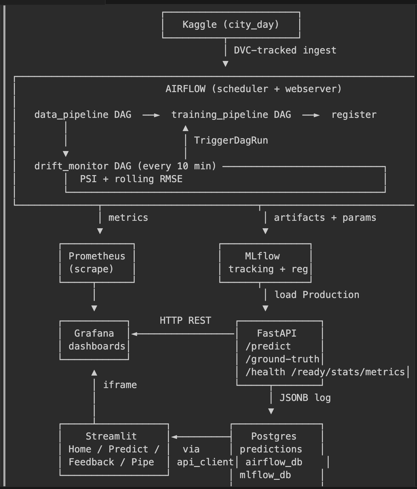

*Figure 1. Architecture diagram showing Kaggle data ingestion, Airflow DAG orchestration, MLflow tracking and registry, FastAPI inference, Streamlit frontend, Postgres persistence, and Prometheus/Grafana monitoring.*

Figure 1 shows the full system architecture. The design places **Airflow** at the center of the operational workflow, with separate DAGs for data preparation, training, and drift monitoring. **MLflow** acts as the experiment tracker and model registry. **FastAPI** serves predictions and receives ground-truth feedback. **Streamlit** provides the end-user interface. **Postgres** stores prediction records and feedback data. **Prometheus** and **Grafana** provide observability. This architecture satisfies the rubric requirement for an architecture diagram and also supports the second guideline’s emphasis on automation, monitoring, version control, and environment parity.

To complement the static architecture image, Figure 1a presents the high-level operational data flow as a directed flowchart. It traces a single record from raw ingestion through training, registry promotion, online inference, feedback capture, and the closed-loop retraining trigger.

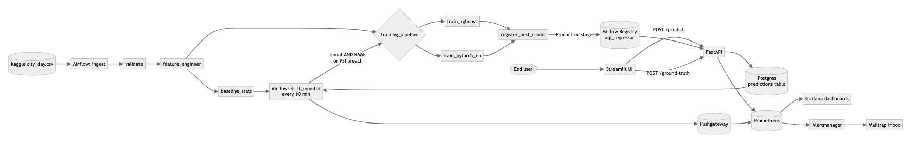

*Figure 1a. High-level design flowchart showing the data path from Kaggle ingestion through Airflow training, MLflow registry promotion, FastAPI inference, Streamlit feedback, drift monitoring, and the closed-loop retraining trigger that feeds back into the training DAG.*

Figure 1a makes the closed-loop nature of the system explicit. The drift monitor reads from the same Postgres table that the API writes to, and either of two independent conditions — the joint **count + rolling-RMSE** gate or the **PSI** gate against the feature baseline — can fan back into the training DAG. The Prometheus to Grafana to Mailtrap path on the right of the chart is the observability surface visible to operators, while the Streamlit to FastAPI path on the left is the surface visible to the end user. The two surfaces meet at the Postgres predictions table, which is the single source of truth for both inference history and retrain decisions.

## 5. Demonstration 

### 5.1 Web Application Front-end UI/UX Design 

The web interface is implemented as a Streamlit multipage application containing the following screens:

- `Home`
- `Predict`
- `Feedback`
- `Pipeline`

The **Home** page is designed as a system entry point and operational summary.

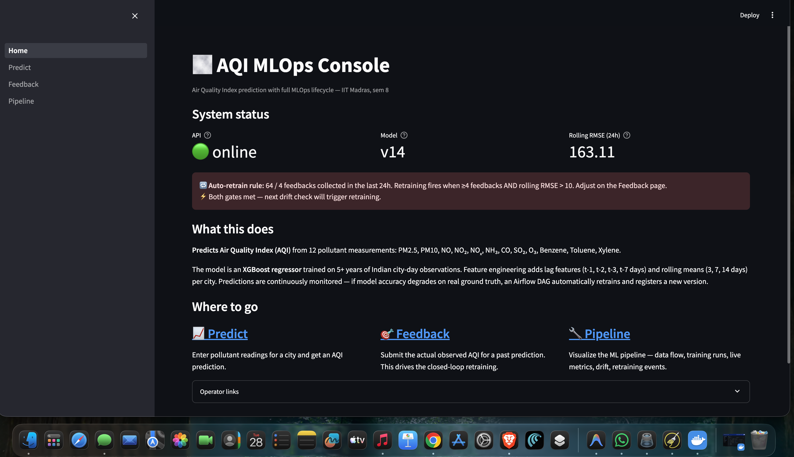

*Figure 2. Home page of the AQI MLOps Console showing API status, deployed model version `v14`, rolling RMSE `163.11`, and the auto-retrain banner indicating that both retraining gates are met.*

Figure 2 demonstrates that the frontend is not limited to prediction alone. It provides system awareness to the user by displaying API health, deployed model version, rolling RMSE, and the retraining status banner. The navigation links to `Predict`, `Feedback`, and `Pipeline` are directly visible on the same page. This supports the rubric requirement that the UI should be intuitive and meaningful from a non-technical user’s perspective.

The **Predict** page provides the main user interaction workflow.

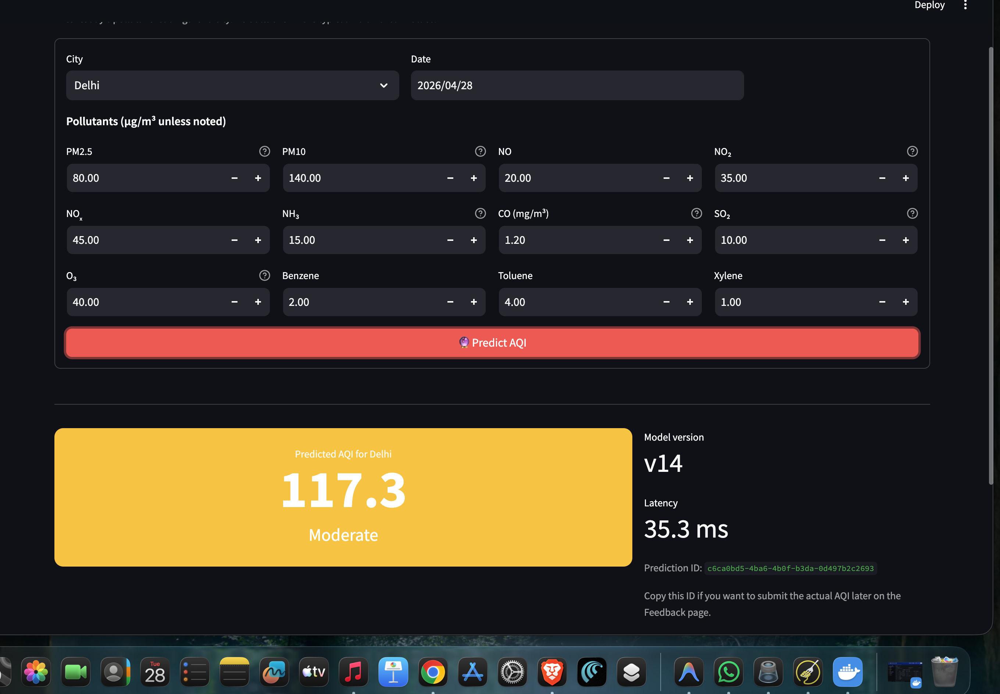

*Figure 3. Predict page showing structured pollutant inputs for Delhi and a generated AQI prediction of `117.3`, classified as `Moderate`, produced by model version `v14` with a latency of `35.3 ms`.*

Figure 3 shows that the frontend uses structured inputs for city, date, and pollutant values. It also shows the returned prediction, AQI category, model version, latency, and a unique prediction identifier. This is significant from the rubric perspective because the interface remains understandable without requiring direct interaction with backend services or technical infrastructure.

The **Feedback** page is designed as the operational entry point for the closed-loop retraining process. It exposes the retraining rule in plain language and allows ground-truth submission.

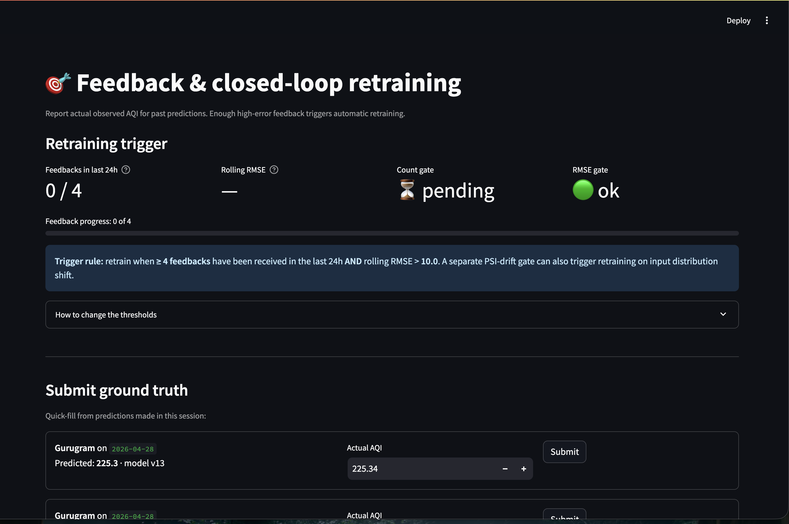

*Figure 4. Feedback page in the initial state with `0 / 4` feedback records in the active window, no rolling RMSE yet available, count gate pending, and RMSE gate marked as `ok`.*

Figure 4 demonstrates the initial state of the feedback loop. At this stage, the retraining thresholds are visible, but no breach has yet occurred. This design is important because it makes the retraining logic understandable to the user rather than hiding it as an internal backend process.

The progression of retraining conditions is illustrated across four successive screenshots.

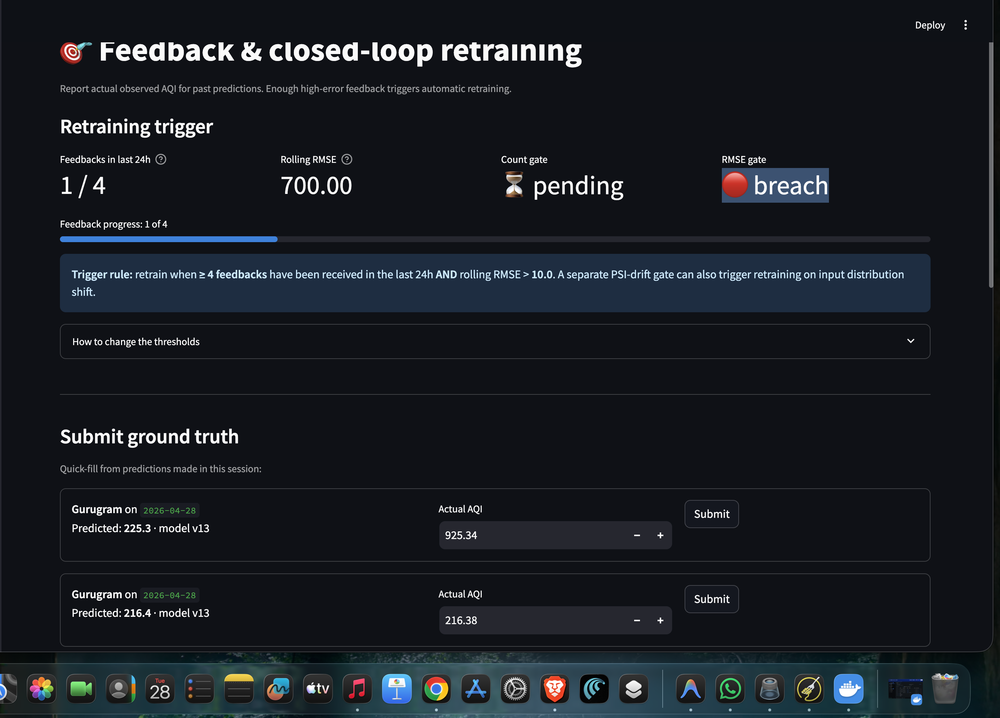

*Figure 5. Feedback page after the first high-error feedback submission, showing `1 / 4` feedbacks, rolling RMSE `700.00`, count gate pending, and RMSE gate in breach state.*

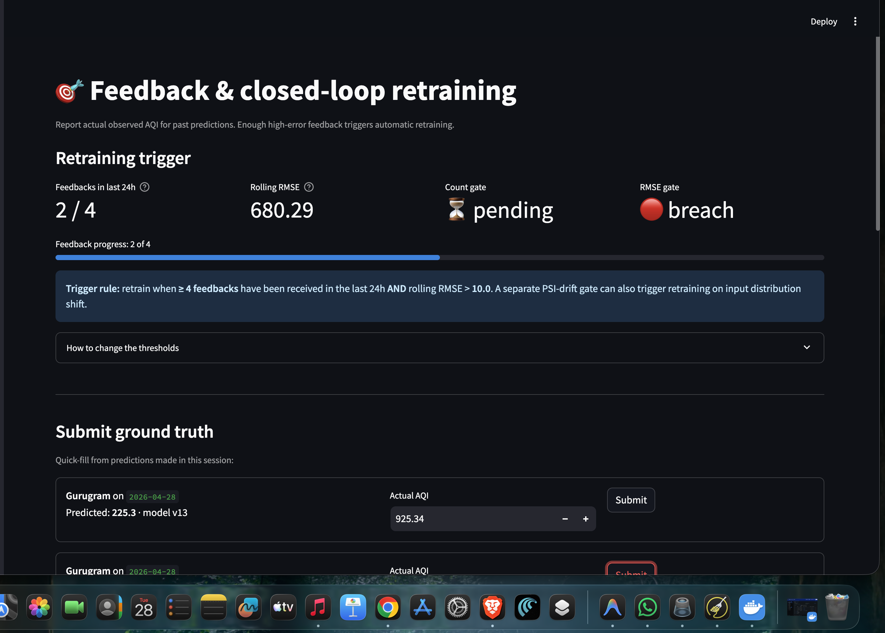

*Figure 6. Feedback page after the second feedback submission, showing `2 / 4` feedbacks and rolling RMSE `680.29`, while the count gate remains pending.*

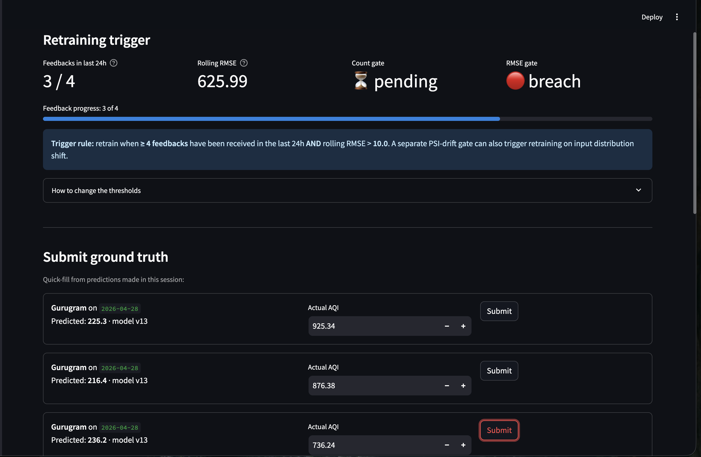

*Figure 7. Feedback page after the third feedback submission, showing `3 / 4` feedbacks and rolling RMSE `625.99`, with the RMSE breach still active.*

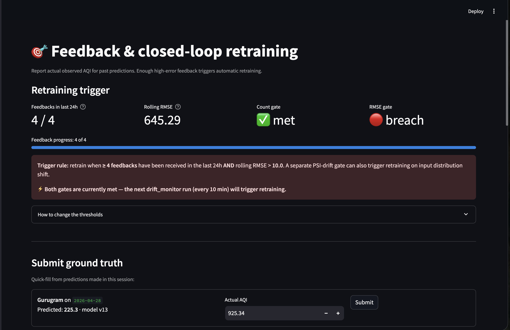

*Figure 8. Feedback page after the fourth feedback submission, showing `4 / 4` feedbacks, rolling RMSE `645.29`, count gate marked `met`, and the explicit message that the next drift-monitor run will trigger retraining.*

Figures 5 through 8 show the retraining logic in a sequential and transparent manner. The feedback count threshold and RMSE breach are not abstract configuration values alone; they are surfaced directly in the user interface. This satisfies the rubric’s expectation that the UI be usable and also reinforces the second guideline’s emphasis on a real-world feedback loop for monitoring model decay.

The system also stores and exposes feedback history for inspection and reuse.

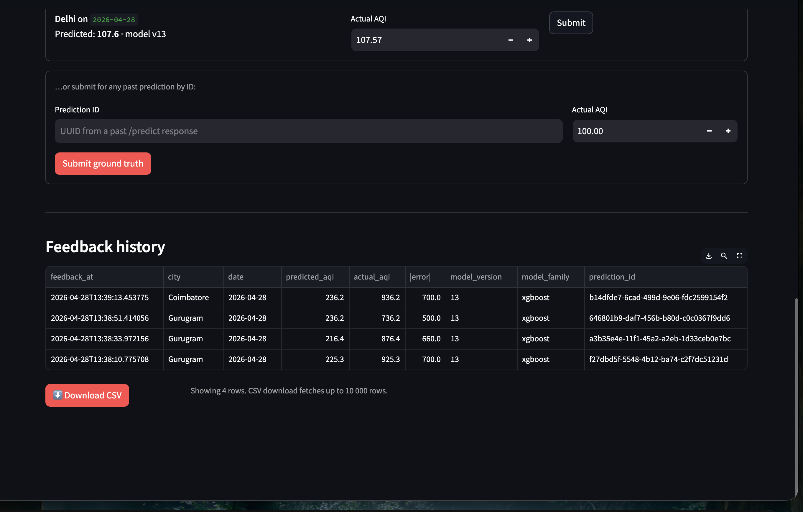

*Figure 9. Feedback history table showing stored records with `city`, `date`, `predicted_aqi`, `actual_aqi`, absolute error, model version, model family, and prediction identifier, along with CSV download capability.*

Figure 9 shows that feedback is treated as a reusable operational asset rather than a temporary UI event. The presence of the table and export function supports later retraining, auditability, and traceability. This is directly aligned with the MLOps maintenance and monitoring rubric requirements.

### 5.2 ML Pipeline Visualization 

The project contains a dedicated pipeline-management screen implemented in the `Pipeline` page. This screen serves as the visual consolidation point for orchestration, tracking, and runtime performance.

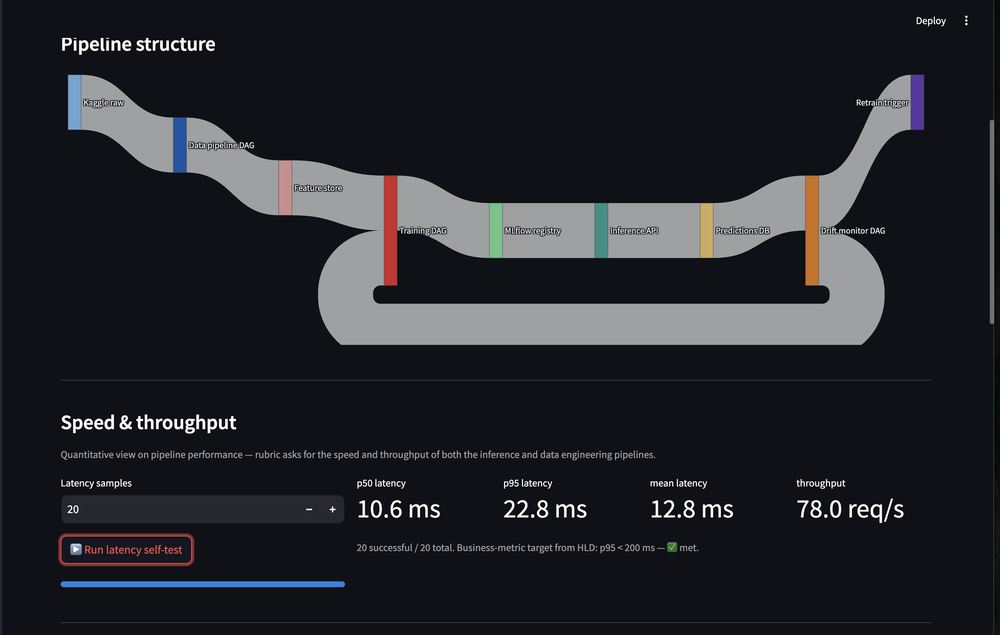

*Figure 10. Pipeline page showing the Sankey-style pipeline structure and the latency self-test results: p50 `10.6 ms`, p95 `22.8 ms`, mean `12.8 ms`, and throughput `78.0 req/s`.*

Figure 10 satisfies multiple items from the pipeline-visualization rubric. It shows a separate UI screen for the machine learning pipeline, a pipeline management console, and a direct measurement of speed and throughput. The visual flow from raw data through feature engineering, training, inference, prediction storage, drift monitoring, and retraining is represented in one place.

The Airflow pipeline history is also explicitly visible.

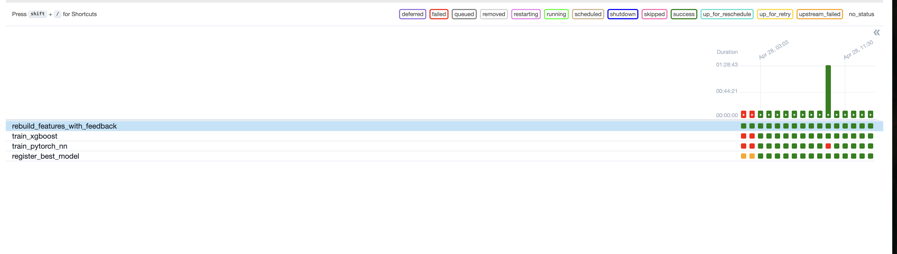

*Figure 11. Airflow task-history view for the training pipeline showing repeated successful runs of `rebuild_features_with_feedback`, `train_xgboost`, `train_pytorch_nn`, and `register_best_model`, along with earlier transient failures.*

Figure 11 demonstrates that the application provides a console to track successful runs and failures, as required by the rubric. The visualization also reveals that the retraining workflow is not merely described in documentation but is operationally executed inside Airflow.

The internal training DAG structure is visible in the graph view.

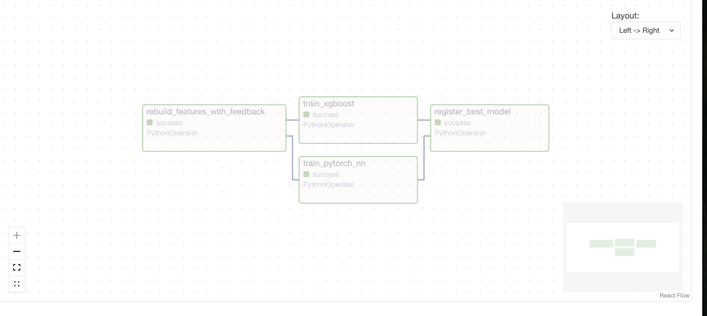

*Figure 12. Airflow graph view showing `rebuild_features_with_feedback` as the first task, followed by parallel training tasks and final model registration.*

Figure 12 is particularly important because it proves that the feedback merge is part of the training DAG itself. This aligns closely with the closed-loop retraining requirement in the second rubric document.

The success of a manually triggered retraining run is also documented.

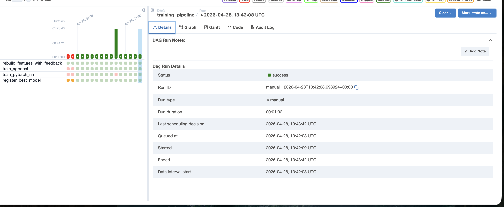

*Figure 13. Airflow run-details page for a manual `training_pipeline` execution, showing overall status `success` and a run duration of `00:01:32`.*

Figure 13 shows that retraining can be invoked on demand through the orchestration layer and that the operational log contains clear execution metadata such as status, run type, and duration.

## 6. Software Engineering 

### 6.1 Design Principle 

The project includes the full documentation set expected by the evaluation guideline:

- architecture diagram with explanation of blocks
- high-level design document
- low-level design document with API definitions and I/O
- test plan and test cases
- user manual for a non-technical user

The API specification is directly exposed through FastAPI documentation.

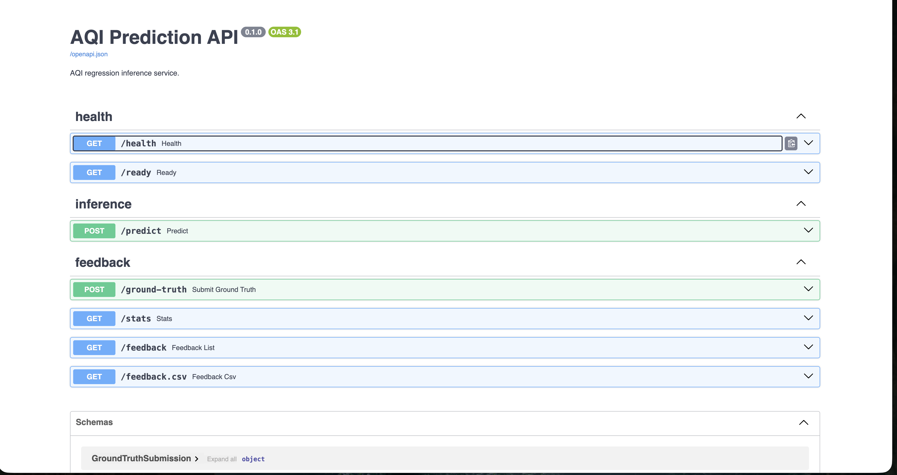

*Figure 14. FastAPI OpenAPI documentation showing `/health`, `/ready`, `/predict`, `/ground-truth`, `/stats`, `/feedback`, and `/feedback.csv`.*

Figure 14 confirms that the low-level API surface is clearly defined and exposed through an OpenAPI interface. This satisfies the LLD-oriented portion of the rubric and reinforces the separation between frontend and backend through REST APIs.

To make the request-level behaviour of the system explicit, Figure 14a presents a low-level flowchart of the inference and feedback paths. It traces a single `POST /predict` call through input validation, the cached `ModelLoader` singleton, the registry-backed model artifact, feature transformation, persistence, and instrumentation, and then traces the corresponding `POST /ground-truth` call through to its effect on the rolling-RMSE gate consumed by the drift monitor.

*Figure 14a. Low-level design flowchart showing the synchronous request lifecycle inside FastAPI for `/predict` and `/ground-truth`, alongside the asynchronous Airflow `drift_monitor` loop that consumes the same Postgres `predictions` table and triggers retraining when either gate fires.*

Figure 14a complements the LLD document by showing how the endpoints listed in Figure 14 actually compose at runtime. The diagram also surfaces the two design choices called out in the HLD: the `ModelLoader` is a singleton so registry lookups are amortized across requests, and the drift monitor is decoupled from the API entirely — it shares state only through the Postgres `predictions` table, which keeps the inference path fast and observable in isolation.

The project also follows a mixed functional and object-oriented design. Functional modules are used for ingestion, validation, transformation, monitoring, and training pipelines, while small object-oriented components are used where they are appropriate, such as the API model loader, ORM model, and PyTorch neural network model definition.

### 6.2 Implementation 

The codebase follows a structured Python layout with separated modules for:

- data ingestion and validation
- feature engineering
- model training
- model registration
- monitoring
- API serving
- frontend communication

Standardized code quality support is present through Ruff configuration. Logging is implemented throughout the ingestion, training, monitoring, and API layers. Exception handling is present in the API boundary and in operational modules such as dataset ingestion and feedback loading. Unit and integration test suites are also provided in the repository.

The design also adheres to loose coupling between frontend and backend. The frontend depends on `frontend/api_client.py` for communication, while the backend exposes configurable REST endpoints through FastAPI.

### 6.3 Testing 

The project includes a written test plan and corresponding unit and integration tests. The available screenshot evidence shows the unit test suite executing successfully.

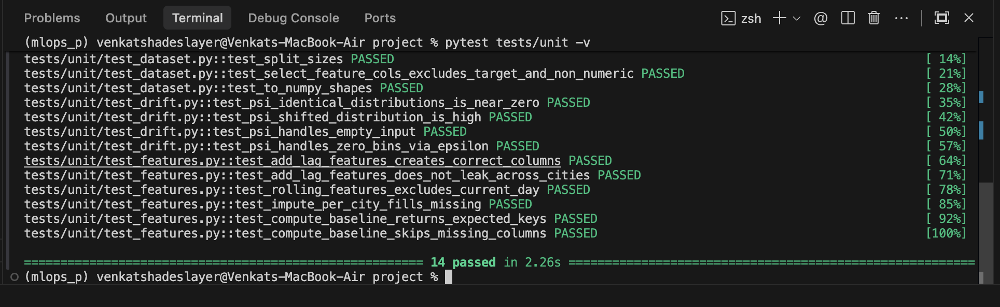

*Figure 15. Unit test output showing `14 passed`, covering dataset logic, drift computation, and feature-engineering utilities.*

Figure 15 demonstrates that the project includes a working unit test suite. The repository also contains integration test cases targeting the live API endpoints, although the screenshot evidence specifically documents unit testing rather than a live integration session.

## 7. MLOps Implementation 

### 7.1 Data Engineering 

The data engineering pipeline is implemented using **Airflow** and mirrored through **DVC**. The operational design includes:

- raw data ingestion
- automated validation
- feature engineering
- baseline-statistics generation for drift monitoring

This satisfies the requirement that the project include a real data ingestion or transformation pipeline using one of the recommended orchestration technologies.

### 7.2 Source Control and Continuous Integration [2]

The repository uses:

- **Git** for source versioning
- **Git LFS** patterns in `.gitattributes`
- **DVC** for pipeline representation
- **GitHub Actions** for CI

The DVC pipeline and CI workflow together support the version-control and continuous-integration expectations of the rubric. The repository structure also reflects separate treatment of code, data-processing stages, and packaged services.

### 7.3 Experiment Tracking 

MLflow is used for experiment tracking and model registry management.

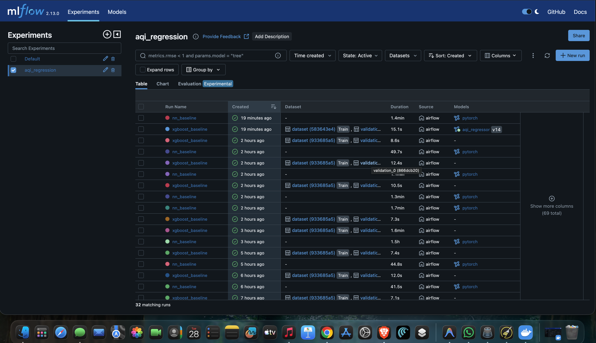

*Figure 16. MLflow experiment view showing multiple training runs for both `nn_baseline` and `xgboost_baseline`, with a recent `xgboost_baseline` run linked to registered model `aqi_regressor v14`.*

Figure 16 shows the ongoing nature of experiment tracking. It indicates that the project is not limited to a single static training run; rather, multiple runs are retained and compared over time.

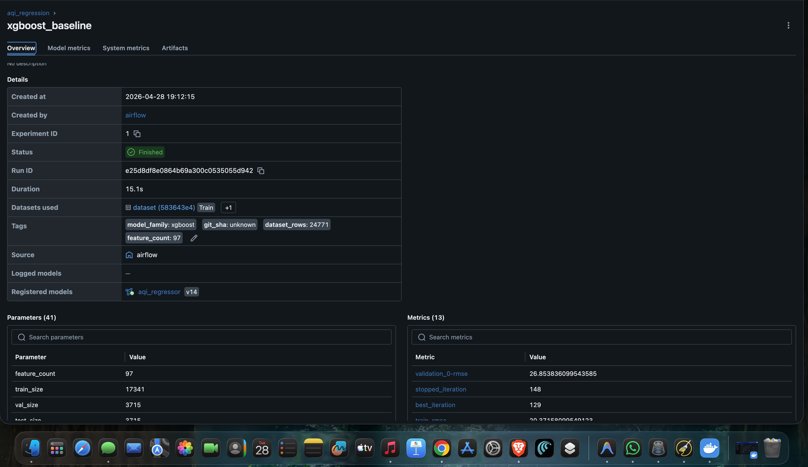

*Figure 17. MLflow run overview for `xgboost_baseline`, showing status `Finished`, duration `15.1 s`, tags such as `model_family=xgboost`, `dataset_rows=24771`, `feature_count=97`, and registration under `aqi_regressor v14`.*

Figure 17 demonstrates that the project tracks more than the default autolog outputs. It records dataset size, feature count, and model family, thereby supporting reproducibility and experiment analysis.

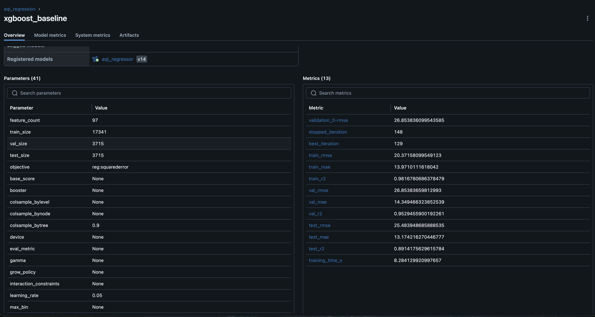

*Figure 18. MLflow metrics page showing model parameters and evaluation metrics including validation RMSE, train RMSE, test RMSE, MAE, R², and training time.*

Figure 18 shows the detailed metrics collected for the model run. The screenshot provides visible evidence that the system tracks metrics, parameters, and model artifacts in a structured manner, which is one of the central requirements of the experiment-tracking rubric.

### 7.4 Exporter Instrumentation and Visualization 

The project implements Prometheus-based instrumentation and Grafana-based visualization for near real-time monitoring.

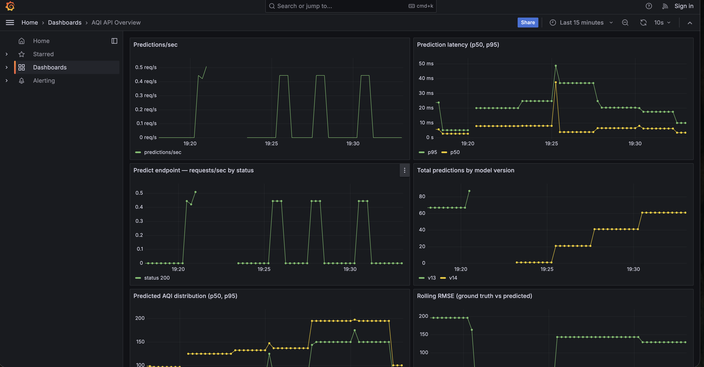

*Figure 19. Grafana dashboard displaying predictions per second, prediction latency, request rates by status, prediction counts by model version, predicted AQI distribution, and rolling RMSE.*

Figure 19 demonstrates that the monitored signals are not limited to infrastructure status alone. The dashboard includes application-level and model-level information such as prediction throughput, latency, model version distribution, and rolling RMSE. This aligns directly with the rubric’s requirement for monitored information points and Grafana visualization.

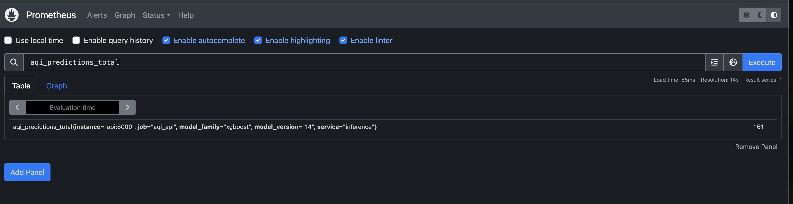

*Figure 20. Prometheus query result for `aqi_predictions_total`, showing a labeled series for `model_family="xgboost"` and `model_version="14"` with observed count `161`.*

Figure 20 confirms that the metrics shown in Grafana originate from a Prometheus-readable instrumentation layer. The presence of model family and model version labels strengthens the traceability of production monitoring.

### 7.5 Software Packaging 

The project is packaged as a multi-container local deployment using Docker Compose. The services include frontend, backend API, Airflow, MLflow, Postgres, Prometheus, Grafana, and Pushgateway. The deployment design satisfies the rubric expectation that the backend and frontend should be dockerized and run as separate services.

The effectiveness of this packaging approach is reflected across the already documented runtime views. Figure 2 shows the frontend consuming live backend state, Figure 14 shows the API service exposed through FastAPI documentation, Figures 11 through 13 show the Airflow service executing the orchestration workflow, and Figures 19 and 20 show the monitoring stack actively collecting and displaying metrics. Taken together, these views confirm that the application is not a collection of isolated scripts, but a composed local system in which separately packaged services interact correctly.

## 8. Closed-Loop Monitoring, Feedback, and Maintenance

The second rubric document places special emphasis on feedback loops, real-world performance decay, drift detection, retraining, and alerting. The screenshot evidence strongly supports this aspect of the project.

The progression from Figures 4 through 8 already established the feedback-trigger logic in the UI. The following screenshots strengthen the monitoring and maintenance interpretation.

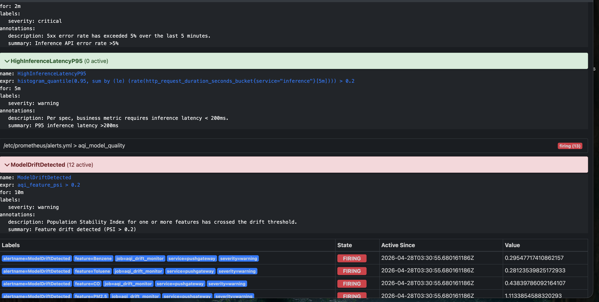

*Figure 21. Prometheus alerts view showing configured rules such as `HighInferenceLatencyP95` and `ModelDriftDetected`, together with active firing alerts for multiple features whose PSI values have crossed the drift threshold.*

Figure 21 provides direct evidence that the monitoring stack does not stop at passive dashboarding. The system defines explicit alert rules for business and model-quality conditions, including high inference latency and feature drift. The active alert rows visible in the screenshot show that Prometheus is evaluating these rules against live signals and surfacing a firing state when thresholds are crossed. This is closely aligned with the rubric requirement that the application should detect abnormal behavior and produce actionable alerts.

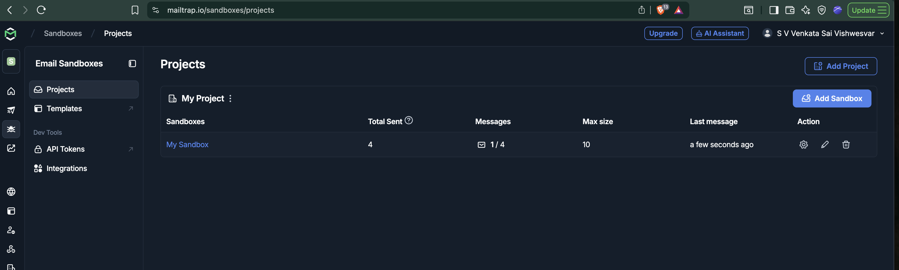

*Figure 22. Mailtrap project view showing the configured sandbox and sent-message count, supporting the alert-delivery test setup.*

Figure 22 demonstrates that alert-delivery infrastructure was set up and observed through Mailtrap. This supports the alerting requirement from the second rubric document.

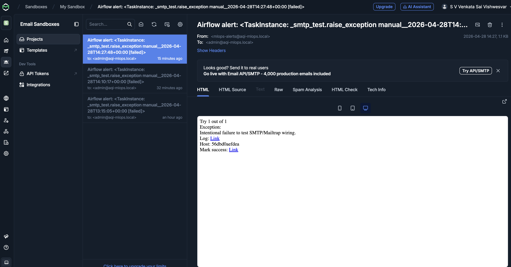

*Figure 23. Mailtrap inbox showing an Airflow alert email generated by the intentional `_smtp_test.raise_exception` failure, confirming that the alert pipeline is operational.*

Figure 23 confirms that the alerting path is not merely configured but actually exercised. The intentional SMTP test failure results in a delivered email alert, thereby validating the operational monitoring workflow.

## 9. Conclusion

The AQI MLOps project satisfies the major expectations of the evaluation rubrics by presenting a complete local MLOps workflow around AQI prediction. The evidence demonstrates:

- a usable web application for prediction and feedback
- a dedicated pipeline-visualization and management screen
- documented architecture, HLD, LLD, test plan, and user manual
- experiment tracking through MLflow
- data and model orchestration through Airflow
- API serving through FastAPI
- instrumentation through Prometheus
- dashboard visualization through Grafana
- email-alert verification through Mailtrap
- a functional feedback-driven retraining loop

Taken together, the embedded screenshots show that the project is not limited to isolated code modules. It operates as an integrated AI application with a visible lifecycle from data ingestion to deployed model monitoring and retraining. This makes it a strong demonstration of an academically grounded MLOps implementation in accordance with the stated evaluation guidelines.
